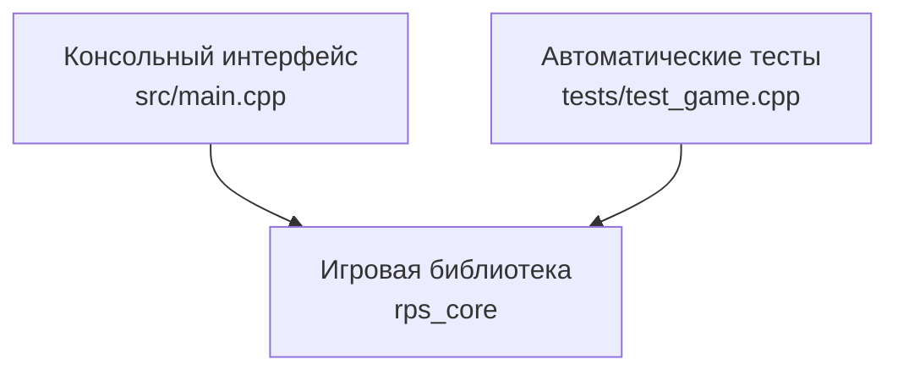

<div align="center">

# ✊ ✋ ✌️ Rock Paper Scissors

### Консольная игра «Камень, ножницы, бумага» на C++17

Небольшой учебный проект, демонстрирующий декомпозицию программы, современный C++, автоматизированное тестирование и организацию сборки через CMake.


</div>

---

## 📖 О проекте

**Rock Paper Scissors** — консольная реализация классической игры «Камень, ножницы, бумага».

Первоначальная версия проекта состояла из одной функции `main()`, внутри которой одновременно находились:

- пользовательский ввод;
- генерация случайного хода компьютера;
- проверка корректности ввода;
- правила определения победителя;
- вывод сообщений;
- управление состоянием программы.

В ходе переработки проект был разделён на независимые компоненты. Игровая логика вынесена в отдельную библиотеку `rps_core`, консольный интерфейс оставлен в `main.cpp`, а основные сценарии покрыты автоматическими тестами.

Проект может использоваться как небольшой учебный пример по следующим темам:

- рефакторинг существующего C++-кода;
- разделение интерфейса и бизнес-логики;
- использование `enum class`;
- обработка ошибок ввода;
- применение `std::optional`;
- управление состоянием объекта;
- работа с `std::mt19937`;
- организация сборки через CMake;
- написание unit-тестов;
- интеграция тестов в процесс сборки.

---

## ✨ Возможности

В переработанной версии реализованы пять основных пользовательских функций.

### 1. Матч до заданного количества побед

Игра больше не заканчивается после одного раунда. Пользователь и компьютер продолжают играть, пока одна из сторон не наберёт необходимое количество побед.

По умолчанию матч идёт до трёх побед:

```sh
./rps
```

Количество побед можно изменить параметром `--wins`:

```sh
./rps --wins 5
```

Ничьи учитываются в статистике, но не приближают ни одну сторону к завершению матча.

---

### 2. Табло и статистика матча

После каждого раунда программа показывает текущий результат:

```text
Score 2:1 (draws: 3)
```

В рамках игровой сессии учитываются:

- победы игрока;
- победы компьютера;
- ничьи;
- общее количество сыгранных раундов.

---

### 3. Удобный пользовательский ввод

Игра принимает полные названия ходов:

```text
rock
paper
scissors
```

Также поддерживаются сокращения:

```text
r
p
s
```

Регистр букв не имеет значения:

```text
ROCK
Paper
sCiSsOrS
```

Начальные и конечные пробелы автоматически удаляются:

```text
   rock
paper
   scissors
```

Некорректный ввод не завершает программу и не изменяет состояние матча:

```text
Invalid choice. Try rock/r, paper/p, scissors/s, or quit.
```

---

### 4. Досрочное завершение игры

Пользователь может отказаться от продолжения матча с помощью одной из команд:

```text
quit
q
```

Программа корректно завершит работу:

```text
Match abandoned.
```

Также обрабатывается завершение стандартного потока ввода — например, `Ctrl+D` в Linux и macOS.

---

### 5. Воспроизводимый генератор ходов

По умолчанию компьютер использует случайно инициализированный генератор:

```sh
./rps
```

Для отладки, тестирования или демонстрации можно установить фиксированный seed:

```sh
./rps --seed 42
```

При одинаковом seed компьютер будет генерировать одинаковую последовательность ходов.

Параметры можно комбинировать:

```sh
./rps --wins 5 --seed 42
```

---

## 🎮 Правила игры

Правила соответствуют классической версии:

| Ход | Побеждает | Проигрывает |
|---|---|---|
| ✊ Камень | ✌️ Ножницы | ✋ Бумага |
| ✋ Бумага | ✊ Камень | ✌️ Ножницы |
| ✌️ Ножницы | ✋ Бумага | ✊ Камень |

Если игрок и компьютер выбрали одинаковый ход, раунд заканчивается ничьёй.

---

## 🖥️ Пример игрового сеанса

```text
Welcome to Rock, Paper, Scissors!
First to 2 wins. Enter rock/r, paper/p, scissors/s, or quit.

> rock
You: rock, computer: scissors
Rock crushes scissors. You win!
Score 1:0 (draws: 0)

> PAPER
You: paper, computer: paper
It's a draw.
Score 1:0 (draws: 1)

> s
You: scissors, computer: paper
Scissors cut paper. You win!
Score 2:0 (draws: 1)

You won the match!
```

Пример обработки неправильного значения:

```text
> stone
Invalid choice. Try rock/r, paper/p, scissors/s, or quit.
```

---

## 🏗️ Архитектура

Проект разделён на три основные части:



### Консольный интерфейс

Файл `src/main.cpp` отвечает за:

- обработку аргументов командной строки;
- чтение пользовательского ввода;
- команды `quit` и `q`;
- отображение хода компьютера;
- вывод результата раунда;
- вывод текущего счёта;
- отображение результата матча.

В `main.cpp` не содержатся непосредственно правила игры.

### Игровая библиотека

Библиотека `rps_core` отвечает за:

- преобразование пользовательского ввода в ход;
- определение результата раунда;
- преобразование хода в строку;
- формирование сообщения о результате;
- хранение счёта;
- управление игровой сессией;
- определение окончания матча;
- генерацию хода компьютера.

### Тесты

Тестовый executable `rps_tests` использует ту же библиотеку `rps_core`, что и основное приложение.

Благодаря этому тесты проверяют реальную игровую логику без запуска консольного интерфейса.

---

## 📁 Структура проекта

```text
rock-paper-scissors/
├── CMakeLists.txt
├── README.md
├── REVIEW_LOG.md
├── BUILD_REPORT.md
├── .gitignore
│
├── include/
│   └── rps/
│       └── game.hpp
│
├── src/
│   ├── game.cpp
│   └── main.cpp
│
└── tests/
    └── test_game.cpp
```

Подробное назначение файлов:

| Путь | Назначение |
|---|---|
| `CMakeLists.txt` | Конфигурация сборки, целей и тестов |
| `include/rps/game.hpp` | Публичный интерфейс игровой библиотеки |
| `src/game.cpp` | Реализация правил и состояния игры |
| `src/main.cpp` | Консольный пользовательский интерфейс |
| `tests/test_game.cpp` | Автоматические unit-тесты |
| `REVIEW_LOG.md` | Журнал ревизии первоначального исходного кода |
| `BUILD_REPORT.md` | Отчёт о компиляции и тестировании |
| `.gitignore` | Исключения для Git |

---

## 🧰 Требования

Для сборки проекта необходимы:

- компилятор с поддержкой C++17;
- CMake версии 3.16 или новее;
- стандартная библиотека C++;
- CTest, поставляемый вместе с CMake.

Подходящие компиляторы:

- GCC 8 или новее;
- Clang 7 или новее;
- Microsoft Visual C++ 2019 или новее;
- Apple Clang с поддержкой C++17.

Внешние библиотеки и package manager не требуются.

---

## 🚀 Быстрый старт

### Клонирование репозитория

```sh
git clone <URL-РЕПОЗИТОРИЯ>
cd rock-paper-scissors
```

Замените `<URL-РЕПОЗИТОРИЯ>` адресом своего GitHub-репозитория.

---

## 🔨 Сборка в Linux и macOS

### Debug-сборка

```sh
cmake -S . -B build -DCMAKE_BUILD_TYPE=Debug
cmake --build build --parallel
```

Запуск приложения:

```sh
./build/rps
```

### Release-сборка

```sh
cmake -S . -B build -DCMAKE_BUILD_TYPE=Release
cmake --build build --parallel
```

Запуск:

```sh
./build/rps
```

---

## 🪟 Сборка в Windows

### Visual Studio Generator

Откройте PowerShell в каталоге проекта:

```powershell
cmake -S . -B build
cmake --build build --config Debug
```

Запуск Debug-версии:

```powershell
.\build\Debug\rps.exe
```

Release-сборка:

```powershell
cmake --build build --config Release
```

Запуск Release-версии:

```powershell
.\build\Release\rps.exe
```

### MinGW

```powershell
cmake -S . -B build -G "MinGW Makefiles"
cmake --build build
```

Запуск:

```powershell
.\build\rps.exe
```

---

## ⚙️ Аргументы командной строки

Общий формат запуска:

```text
rps [--wins N] [--seed N] [--help]
```

| Параметр | Описание | Значение по умолчанию |
|---|---|---|
| `--wins N` | Количество побед, необходимое для завершения матча | `3` |
| `--seed N` | Фиксированный seed генератора случайных чисел | случайный |
| `--help` | Вывод краткой справки | — |

### Примеры

Матч до трёх побед:

```sh
./build/rps
```

Матч до одной победы:

```sh
./build/rps --wins 1
```

Матч до пяти побед:

```sh
./build/rps --wins 5
```

Воспроизводимый запуск:

```sh
./build/rps --seed 42
```

Матч до пяти побед с фиксированным seed:

```sh
./build/rps --wins 5 --seed 42
```

Справка:

```sh
./build/rps --help
```

---

## 🧪 Тестирование

Тесты реализованы без внешнего тестового framework. Это позволяет собрать проект без загрузки GoogleTest, Catch2 или других зависимостей.

После конфигурации проекта тесты можно запустить командой:

```sh
ctest --test-dir build --output-on-failure
```

Для многоконфигурационного генератора, например Visual Studio:

```powershell
ctest --test-dir build --output-on-failure -C Debug
```

или:

```powershell
ctest --test-dir build --output-on-failure -C Release
```

---

## ✅ Автоматическая проверка во время сборки

По умолчанию тесты запускаются автоматически при выполнении:

```sh
cmake --build build
```

В CMake создана цель `check`, включённая в стандартную сборку:

```cmake
add_custom_target(check ALL
    COMMAND ${CMAKE_CTEST_COMMAND}
            --output-on-failure
            -C $<CONFIG>
    DEPENDS rps_tests
    WORKING_DIRECTORY ${CMAKE_BINARY_DIR}
)
```

Порядок выполнения:

1. компилируется библиотека `rps_core`;
2. компилируется тестовый executable `rps_tests`;
3. CTest запускает зарегистрированные тесты;
4. при успешном прохождении сборка продолжается;
5. если тест не проходит, вся сборка завершается с ошибкой.

Это позволяет обнаруживать регрессии непосредственно во время сборки.

---

## 🧩 Параметры CMake

Проект предоставляет дополнительные параметры конфигурации.

### `RPS_BUILD_TESTS`

Определяет, нужно ли создавать тестовый executable:

```sh
cmake -S . -B build -DRPS_BUILD_TESTS=OFF
```

Значение по умолчанию:

```text
ON
```

### `RPS_TESTS_DURING_BUILD`

Определяет, нужно ли автоматически запускать тесты при каждой сборке:

```sh
cmake -S . -B build -DRPS_TESTS_DURING_BUILD=OFF
```

Значение по умолчанию:

```text
ON
```

При отключённом автоматическом запуске тесты всё ещё можно выполнить вручную:

```sh
ctest --test-dir build --output-on-failure
```

### Полное отключение тестов

```sh
cmake -S . -B build \
    -DBUILD_TESTING=OFF \
    -DRPS_BUILD_TESTS=OFF
```

---

## 🔍 Что проверяют тесты

Тестовый набор охватывает следующие сценарии.

### Разбор пользовательского ввода

Проверяются:

- полные названия ходов;
- сокращённые названия;
- разные регистры;
- начальные и конечные пробелы;
- отклонение неизвестных значений.

Примеры:

```cpp
parseChoice("rock");
parseChoice("  PAPER ");
parseChoice("s");
parseChoice("stone");
```

### Все комбинации ходов

Проверяются все девять возможных сочетаний:

| Игрок | Компьютер | Ожидаемый результат |
|---|---|---|
| Камень | Камень | Ничья |
| Камень | Бумага | Поражение |
| Камень | Ножницы | Победа |
| Бумага | Камень | Победа |
| Бумага | Бумага | Ничья |
| Бумага | Ножницы | Поражение |
| Ножницы | Камень | Поражение |
| Ножницы | Бумага | Победа |
| Ножницы | Ножницы | Ничья |

### Игровая сессия

Проверяется:

- продолжение матча до достижения цели;
- завершение матча при достижении цели;
- правильное определение победителя;
- подсчёт побед;
- подсчёт ничьих;
- подсчёт общего количества раундов.

### Защита состояния

Проверяется:

- запрет создания матча до нуля побед;
- запрет нового раунда после завершения матча.

### Генератор компьютера

Проверяется, что два генератора с одинаковым seed создают одинаковые последовательности ходов.

---

## 🧠 Основные технические решения

### `enum class` вместо строк

Ходы и результаты представлены строгими типами:

```cpp
enum class Choice {
    rock,
    paper,
    scissors
};

enum class Outcome {
    win,
    loss,
    draw
};
```

Это защищает игровую логику от произвольных строк и опечаток.

---

### `std::optional` для разбора ввода

Функция разбора возвращает:

```cpp
std::optional<Choice>
```

Если ввод корректен, возвращается конкретный ход. Если значение распознать нельзя, возвращается `std::nullopt`.

---

### Чистая функция определения результата

Правила находятся в функции:

```cpp
Outcome determineOutcome(
    Choice player,
    Choice computer
);
```

Она:

- не читает консоль;
- не выводит сообщения;
- не изменяет глобальное состояние;
- не использует генератор случайных чисел.

Благодаря этому все комбинации легко проверяются unit-тестами.

---

### Отдельная модель игровой сессии

Класс `GameSession` отвечает за:

- цель матча;
- количество сыгранных раундов;
- победы игрока;
- победы компьютера;
- ничьи;
- определение завершения матча;
- защиту от игры после завершения.

---

### `std::mt19937` вместо `rand()`

Для генерации ходов компьютера используется:

```cpp
std::mt19937
```

В отличие от глобального `rand()`, такой генератор:

- хранит состояние внутри объекта;
- удобнее тестируется;
- поддерживает воспроизводимые последовательности;
- работает совместно с равномерным распределением.

---

## 📝 Журнал ревизии

Подробный анализ первоначального исходного кода находится в файле:

[`REVIEW_LOG.md`](REVIEW_LOG.md)

В журнале зафиксированы:

- найденные проблемы;
- приоритет каждой проблемы;
- возможные последствия;
- выполненные исправления;
- покрытые тестами сценарии;
- оставшиеся ограничения.

---

## 📊 Отчёт о сборке

Результаты фактической компиляции и тестирования находятся в:

[`BUILD_REPORT.md`](BUILD_REPORT.md)

В отчёте указаны:

- использованный компилятор;
- версия стандарта C++;
- параметры предупреждений;
- команды компиляции;
- результат unit-тестов;
- результат smoke-теста приложения.

---

## 🛠️ Сборка без CMake

Если CMake недоступен, проект можно собрать непосредственно компилятором.

### GCC или Clang

Сборка приложения:

```sh
c++ -std=c++17 \
    -Wall -Wextra -Wpedantic \
    -Iinclude \
    src/game.cpp \
    src/main.cpp \
    -o rps
```

Сборка тестов:

```sh
c++ -std=c++17 \
    -Wall -Wextra -Wpedantic \
    -Iinclude \
    src/game.cpp \
    tests/test_game.cpp \
    -o rps_tests
```

Запуск тестов:

```sh
./rps_tests
```

Запуск игры:

```sh
./rps
```

---

## 🗺️ Возможные дальнейшие улучшения

Проект можно расширить следующими функциями:

- сохранение статистики между запусками;
- таблица лучших результатов;
- выбор языка интерфейса;
- режим «игрок против игрока»;
- режим турнира;
- дополнительные игровые фигуры;
- настройка правил;
- цветной вывод в терминале;
- графический интерфейс;
- интеграционные тесты CLI;
- GitHub Actions для сборки на Linux, Windows и macOS;
- подключение полноценного тестового framework;
- анализ покрытия кода;
- статический анализ через Clang-Tidy;
- форматирование через Clang-Format;
- установка приложения через `cmake --install`.

---

## ⚠️ Текущие ограничения

Текущая версия проекта имеет несколько намеренных ограничений:

- статистика хранится только до завершения программы;
- интерфейс доступен только на английском языке;
- поддерживается только игра против компьютера;
- отсутствует графический интерфейс;
- unit-тесты используют небольшой собственный тестовый механизм;
- отсутствует сетевой режим.

Эти ограничения оставлены намеренно, чтобы проект сохранял учебный и компактный характер.

---

## 📚 Чему демонстрирует проект

После изучения проекта можно понять:

- как разделить монолитную функцию `main()`;
- как спроектировать небольшую библиотеку;
- как заменить строки на строгие типы;
- как сделать случайное поведение воспроизводимым;
- как отделить ввод и вывод от бизнес-логики;
- как создать тестируемую игровую модель;
- как описать C++-проект с помощью CMake;
- как зарегистрировать тесты в CTest;
- как запускать тесты во время стандартной сборки;
- как документировать проведённую ревизию.

---

## 📄 Лицензия

Лицензия пока не указана.

Если проект планируется публиковать или разрешить его свободное использование, рекомендуется добавить файл `LICENSE`, например с лицензией MIT.

---

<div align="center">

### Проект подготовлен как учебный пример рефакторинга, тестирования и организации C++-сборки

⭐ Если проект оказался полезен, можно отметить репозиторий звездой на GitHub.

</div>
